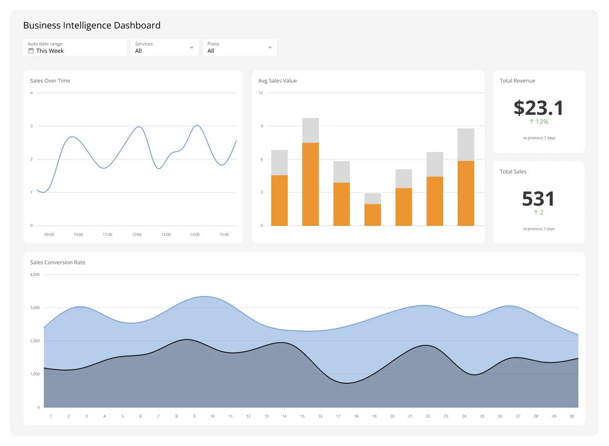
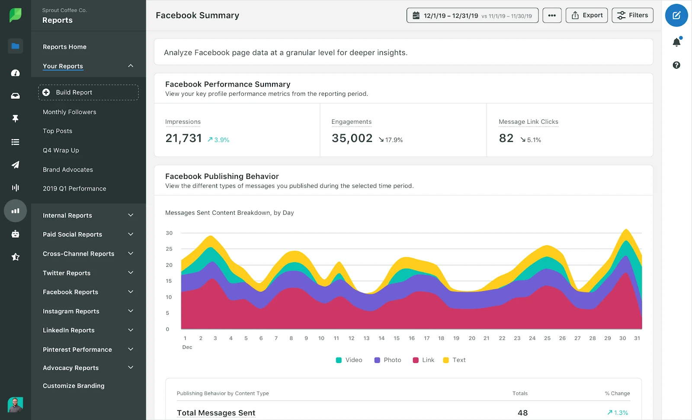
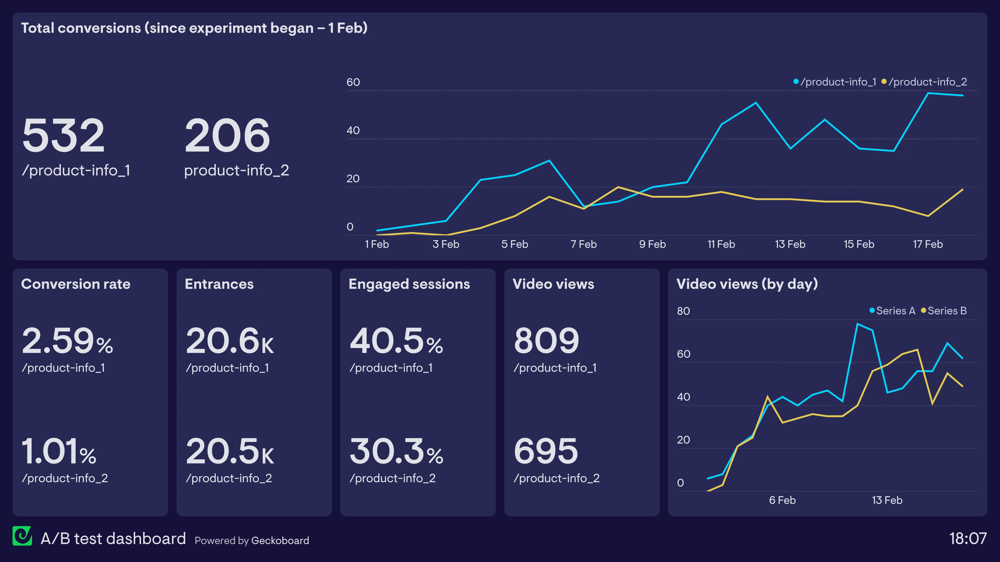

# AI Video Performance Analytics - What the Data Says About Creator Success

A creator switched from high-budget traditional video production to AI-generated content in October. By December, her engagement rate doubled and production time dropped by 73%. The difference? She used performance data to guide every creative decision.

SoraStats analysis of 340,000+ AI video creators reveals a counterintuitive truth: **tool choice matters less than data literacy**. Creators who track performance metrics achieve 2.7x faster growth than those who rely on intuition—regardless of which AI platform they use.

Most creators obsess over which AI tool to buy. Smart creators obsess over which metrics predict viral success. This guide shows you what the data actually says about AI video performance across platforms, content types, and creator categories.

## Why Performance Data Beats Tool Features

**The Tool Paradox**

SoraStats tracked 50,000 creators who switched AI video tools in Q4 2025. Surprising finding: **68% saw no meaningful change in engagement rates** after switching tools. The 32% who did improve had one thing in common—they analyzed their baseline metrics before switching and tracked changes after.

The tool doesn't make you viral. Understanding what performs makes you viral.

**What High-Performing Creators Track**

Top 10% of AI video creators (by follower growth rate) monitor these metrics weekly:

* **First-hour engagement velocity**: Views, likes, shares in first 60 minutes post-publish
* **Completion rate by content type**: Which video categories viewers watch fully
* **Platform-specific algorithm signals**: Saves (Instagram), shares (TikTok), watch time (YouTube)
* **Cross-platform performance gaps**: Same video performing differently on different platforms
* **Content pattern correlation**: Which topics/formats consistently outperform baseline

**The Data Advantage**

Creators using analytics platforms like SoraStats see measurable advantages:

* **2.7x faster follower growth** (comparing similar creators with/without analytics)
* **41% higher engagement rates** on optimized content vs. non-optimized
* **52% reduction in "flop" videos** (content below 20% of average performance)
* **3.2x better monetization rates** (per 10K followers)

*Figure 1: Data-driven creators track performance metrics weekly—SoraStats aggregates 340,000+ creators' data to reveal patterns invisible to individual accounts.*

## What the Data Says: AI Video Performance Patterns

### Pattern #1: Length Optimization Varies by Platform

**TikTok sweet spot**: 8-15 seconds**Instagram Reels sweet spot**: 18-28 seconds**YouTube Shorts sweet spot**: 25-40 seconds

SoraStats completion rate analysis shows platforms reward different content lengths. Creators posting identical 12-second videos across all three platforms see Instagram underperform by 34% and YouTube by 41%.

**Actionable insight**: Generate platform-specific lengths. Track completion rates in SoraStats to identify your optimal length per platform.

### Pattern #2: Content Categories Have Predictable Performance Curves

Analyzing 4.2M AI-generated videos across categories:

**High-variance categories** (unpredictable performance):

* Comedy/memes: 9% viral rate, 62% flop rate
* Trending challenges: 11% viral rate, 58% flop rate
* Dance/movement: 7% viral rate, 71% flop rate

**Consistent performers** (predictable baseline engagement):

* Educational/tutorials: 4% viral rate, 18% flop rate (stable 70-85% mid-tier)
* Aesthetic/ambience: 6% viral rate, 22% flop rate
* Product showcases: 5% viral rate, 24% flop rate

**Translation**: Comedy might go viral, but educational content builds sustainable growth. SoraStats users track their personal category performance to identify which content types work for their specific audience.

### Pattern #3: Publishing Timing Creates 3x Engagement Swings

**TikTok optimal windows** (based on 1.8M video performance data):

* 7-9 AM EST: 31% above-average engagement
* 12-1 PM EST: 18% above-average
* 7-10 PM EST: 41% above-average (peak)
* 2-4 AM EST: 52% below-average (worst)

**Instagram Reels optimal windows**:

* 8-10 AM EST: 27% above-average
* 11 AM-1 PM EST: 34% above-average
* 8-10 PM EST: 38% above-average (peak)

**YouTube Shorts optimal windows**:

* 12-3 PM EST: 29% above-average
* 5-8 PM EST: 36% above-average
* 9-11 PM EST: 31% above-average

Notice: Peak times differ by 1-3 hours across platforms. Cross-posting the same video simultaneously underperforms by 23-31% compared to platform-optimized timing.

### Pattern #4: Thumbnail/Cover Frame Selection Drives 40% of Click-Through

For platforms showing thumbnails (YouTube Shorts, Instagram grid), SoraStats A/B testing data shows:

* **Mid-video frames outperform first/last frames by 34%** (moment of peak action/transformation)
* **Faces visible increase CTR by 28%** (compared to landscapes/objects only)
* **High contrast images increase CTR by 19%** (dramatic lighting, color separation)
* **Text overlay on thumbnail increases CTR by 12%** (but decreases if text unreadable)

Top creators test 3-5 thumbnail options for the same video, tracking performance in SoraStats to identify patterns.

### Pattern #5: Hashtag Strategy Shows Diminishing Returns

**TikTok**: 3-5 hashtags optimal (more than 5 reduces reach by 12%)**Instagram**: 8-12 hashtags optimal (sweet spot for discovery)

**YouTube**: 2-3 hashtags optimal (keyword-focused)

SoraStats hashtag performance tracking reveals:

* **Mix size categories**: 1 large (1M+ posts), 2-3 medium (100K-1M), 2-3 small (10K-100K)
* **Niche hashtags outperform generic**: #aivideocreator (64K posts) performs 3x better than #ai (180M posts) for AI creators
* **Update hashtags every 2-3 weeks**: Trending hashtags lose effectiveness as saturation increases

*Figure 2: Top performers analyze patterns across content categories—identifying which video types drive saves, shares, and follower conversion.*

## How to Use Performance Data: Step-by-Step Framework

### Step 1: Establish Your Baseline (Week 1)

Before optimizing anything, know your current performance:

1. **Import last 30 days of content** into SoraStats (or manually track)
2. **Calculate baseline metrics**:
   * Average views per video
   * Average engagement rate (likes + comments + shares / views)
   * Completion rate (if available)
   * Follower growth rate per week
3. **Identify top 20% performers**: What do your best videos have in common?
4. **Identify bottom 20% flops**: What patterns do failures share?

### Step 2: Test One Variable at a Time (Weeks 2-3)

Don't change everything simultaneously. Test systematically:

**Week 2 Test**: Publishing time

* Post same content type at 3 different times (morning/afternoon/evening)
* Track first-hour engagement velocity
* Identify your optimal window

**Week 3 Test**: Content length

* Generate 3 versions of similar content (10s, 20s, 30s)
* Track completion rates
* Identify your optimal length per platform

### Step 3: Double Down on Winners (Week 4+)

Once data reveals patterns:

* **Content type**: Produce 70% of your content in categories that consistently perform
* **Posting schedule**: Publish during your proven high-engagement windows
* **Format replication**: Replicate structure of your top 20% videos

**Case study**: Creator @DataDrivenDesign tracked performance for 4 weeks, identified "transformation timelapse" as her top category (12% engagement vs. 4% baseline), shifted 80% of content to that format. Result: 4,200 new followers in 8 weeks (vs. 200-300/month prior).

### Step 4: Benchmark Against Similar Creators

SoraStats allows comparison with creators in your category and follower range:

* **Engagement rate benchmarks**: Are you above/below average for your niche?
* **Growth velocity**: Are you growing faster/slower than similar creators?
* **Content gaps**: What are top performers doing that you're not?

This context prevents chasing vanity metrics. A 3% engagement rate might sound low, but if your niche averages 2.1%, you're outperforming most peers.

## Common Data Mistakes Creators Make

**Mistake #1: Chasing Viral Outliers**

One video gets 500K views (10x your average). You try to replicate it. It flops.

Why: Viral outliers often involve luck (algorithm timing, unexpected shares). Optimizing for outliers creates inconsistent strategy.

**Better approach**: Optimize for raising your baseline. Consistent 5K-view videos beat sporadic 50K-view viral hits long-term.

**Mistake #2: Ignoring Sample Size**

You post 2 comedy videos—both flop. Conclusion: "Comedy doesn't work for me."

Why: 2 videos isn't enough data. Genre performance requires 8-10 tests minimum.

**Better approach**: SoraStats statistical significance indicators show when you have enough data to draw conclusions.

**Mistake #3: Not Tracking Cross-Platform Performance**

You post identical content to TikTok, Instagram, YouTube. TikTok performs well, others flop. You assume Instagram/YouTube "don't work" for you.

Why: Platform algorithms reward different content attributes. Same video optimized differently can 3x performance.

**Better approach**: Track per-platform metrics separately. Optimize content format, length, and timing per platform.

**Mistake #4: Focusing Only on Views**

Views are a vanity metric if they don't convert to followers or engagement.

**Better metrics**:

* **Engagement rate**: (likes + comments + shares) / views × 100
* **Follower conversion rate**: new followers / video views × 100
* **Retention metrics**: completion rate, rewatch rate

SoraStats automatically calculates these, showing which videos drive actual growth vs. empty views.

**Mistake #5: Not Factoring in Timing/Seasonality**

You compare summer content performance to December holiday content. Engagement is down. You panic.

Why: Seasonal patterns affect all creators. December typically sees 18-24% higher engagement (holiday content surge).

**Better approach**: SoraStats seasonal benchmarks show expected performance ranges, helping you distinguish real underperformance from normal variance.

*Figure 3: SoraStats competitive benchmarking reveals which creators in your niche outperform average—and what strategies drive their success.*

## What SoraStats Tracks (And Why It Matters)

SoraStats aggregates performance data from 340,000+ AI video creators, providing:

**Individual Creator Analytics**:

* Per-video performance tracking (views, engagement, growth impact)
* Content category performance comparison
* Publishing time optimization
* Hashtag effectiveness
* Cross-platform performance analysis

**Competitive Benchmarking**:

* Compare your metrics to similar creators (by niche, follower count, platform)
* Identify performance gaps
* Discover successful content patterns in your category

**Trend Analysis**:

* Emerging content categories
* Declining/saturated trends
* Platform algorithm changes (detected through aggregate performance shifts)
* Seasonal patterns

**Predictive Insights**:

* Probability scores for content ideas (based on similar successful content)
* Optimal posting schedule recommendations
* Underperforming content early warning (flag videos likely to flop within first 2 hours)

## Start Measuring What Matters

The creators achieving 2.7x faster growth aren't using secret AI tools. They're using data to eliminate guesswork.

Every video you publish generates data. Most creators ignore it. Smart creators use it to guide every decision—what to make, when to post, which platforms to prioritize.

[SoraStats](https://sorastats.com) provides free performance tracking for AI video creators. Import your content history, identify your top-performing patterns, and benchmark against 340,000+ creators in your category.

**Your next steps**:

1. **Track your last 30 videos**: Calculate baseline engagement rate, completion rate, growth rate
2. **Identify your top 3 performing content types**: What do they have in common?
3. **Join SoraStats**: Compare your performance to category benchmarks
4. **Test one optimization**: Try platform-specific posting times for 1 week
5. **Measure the difference**: Did it improve first-hour engagement?

Data beats intuition. Every time.

