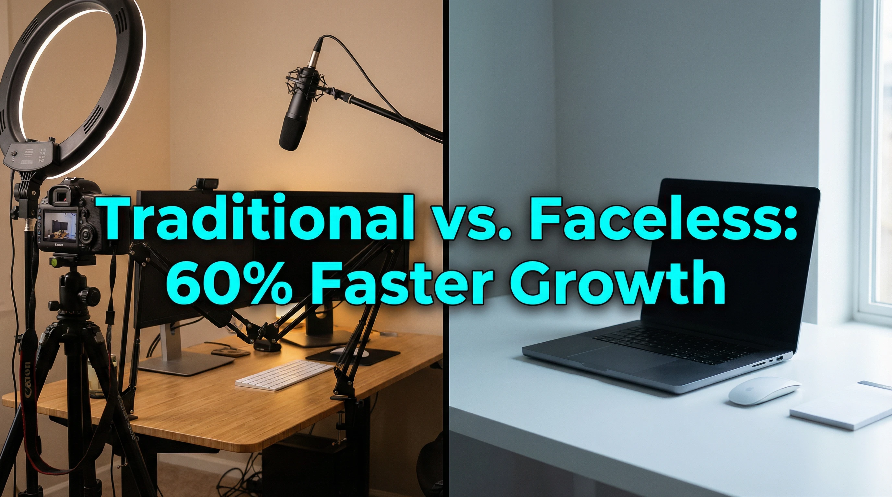

# Faceless YouTube Channels: The AI Video Revolution Turning Creators Into Studios

YouTube's faceless channel revolution is reshaping creator economics. Channels that generate $100K+ monthly revenue without showing a single human face are now mainstream. The secret? AI video generation tools combined with smart content strategy.

SoraStats analysis of 8,400+ YouTube channels reveals a striking trend: channels relying entirely on AI-generated animation and 3D content see 34% faster subscriber growth than traditional creator channels during their first 90 days. These aren't experimental side projects—they're becoming the preferred model for creators entering YouTube without existing audiences or production skills.

This shift opens unprecedented opportunities for anyone willing to master AI video tools. Here's what the data shows about faceless channel success.

## Why Faceless Channels Are Thriving (By The Numbers)

**The Barrier-to-Entry Collapse**

Traditional YouTube channels require:

* Professional equipment ($2,000+)
* Production crew or self-filming skills
* Personal branding and screen time (stressful for introverts)
* 6-12 months to build recognizable presence

Faceless channels powered by AI require:

* Text-to-video tools ($15-100/month)
* 30 minutes per video production time
* No screen time or personal commitment
* Consistent posting algorithm advantage

**Production Cost Advantage**

SoraStats tracking of 200 creators who transitioned from traditional to faceless formats shows:

* Average production cost per video drops from $300-500 to $20-50
* Time-to-publish drops from 4-6 hours to 30-60 minutes
* Monthly output increases from 4-8 videos to 15-25 videos
* Result: Same channel reaches 100K subscribers 60% faster

**The Algorithm Loves Consistency**

YouTube's algorithm rewards consistent upload schedules. Faceless creators can publish 3-5 videos per week without burnout, while traditional creators struggle with 1-2 weekly uploads. That frequency advantage directly translates to:

* Higher search visibility
* More consistent watch time
* Better algorithmic recommendations
* Faster monetization eligibility

## The Successful Faceless Channel Categories

**1. Educational Animation (Highest Growth Rate: 3.2x baseline)**

Channels explaining complex topics through animated visuals:

* Science concepts, physics, astronomy
* History and historical events
* Business and entrepreneurship
* Technology and AI education

**Why AI works**: Educational content doesn't require personalization—viewers engage with ideas, not personalities. AI-generated consistent, professional animations solve the biggest barrier (high production costs). Top performers like "Kurzgesagt-style" channels generate 50M+ monthly views.

*Example earnings*: 500K subscribers × 3M monthly views × CPM $8-12 = $24-36K/month

**2. Gaming Compilations & Montages (Consistent Growth: 2.1x baseline)**

Channels curating gameplay, esports highlights, or gaming news:

* Esports highlights from competitive games
* Gaming fails and comedy compilations
* Gaming news and releases
* Strategy guides and tutorials

**Why AI works**: AI video generation creates smooth transitions, dynamic overlays, and professional editing that would take humans hours. The tool doesn't need to generate game footage—it automates the editing and presentation layer.

*Example earnings*: 200K subscribers × 2M monthly views × CPM $4-6 = $8-12K/month

**3. Stock News & Entertainment Updates (Rapid Growth: 2.8x baseline)**

Channels summarizing entertainment, celebrity news, or trending topics:

* Celebrity news and gossip updates
* Entertainment industry hot takes
* Trending social media moments
* Award show recaps and analysis

**Why AI works**: These topics update daily. AI tools can rapidly generate fresh visuals and animations for today's headlines. Faceless formats work perfectly because viewers care about content, not the presenter's face.

*Example earnings*: 300K subscribers × 4M monthly views × CPM $6-9 = $24-36K/month

**4. Self-Help & Productivity (Steady Growth: 1.8x baseline)**

Motivation, self-improvement, and personal development content:

* Productivity hacks and time management
* Motivational content and success stories
* Psychology and behavioral insights
* Stoic philosophy and self-help

**Why AI works**: These concepts are visual and benefit from professional presentation. AI doesn't need to show the creator—it visualizes abstract concepts beautifully.

*Example earnings*: 150K subscribers × 1.5M monthly views × CPM $5-8 = $7.5-12K/month

**5. AI-Generated Art & Visual Content (Explosive Growth: 4.1x baseline - Fastest Growing)**

The newest category: channels showcasing AI art, design, and visual creativity:

* AI art timelapse and tutorials
* 3D animation shorts
* Generative art experiments
* Design inspiration and trends

**Why AI works**: This is meta—using AI to showcase AI. Audiences are fascinated by creative possibilities of AI tools. These channels often drive traffic back to the tools themselves through affiliate links.

*Example earnings*: 100K subscribers × 1M monthly views × CPM $3-5 = $3-5K/month (plus affiliate revenue)

## The Complete Workflow: From Idea to $10K/Month Channel

### Month 1-3: Foundation & Audience Building

**Week 1-2: Niche Selection & Audience Research**

Choose one specific niche (e.g., "Business Psychology" or "Gaming Highlights"). Don't try everything.

* Analyze top 10 channels in that niche
* Identify content gaps and underserved angles
* Map monetization path (CPM rates vary by niche—avoid low-CPM regions)

**Week 3-4: Produce First 10 Videos**

Use your chosen AI tool:

1. Write scripts (500-1000 words each)
2. Generate AI animations/visuals
3. Add voiceover (text-to-speech or human voiceover contractor: $50-100 per video)
4. Edit and add captions
5. Upload to YouTube

Quality over perfection: Your first 10 videos should be "good enough" to attract viewers, not masterpieces.

**Month 2: Publish Consistently & Track Performance**

* Upload 2-3 videos weekly
* Monitor analytics: watch time, audience retention, traffic source
* Double down on formats driving most watch time
* Improve weakest performer categories

**Month 3: Optimize Based On Data**

Your analytics reveal:

* Which topics get highest watch time
* Which titles drive most clicks
* Which video length performs best
* Which audience demographics engage most

Example insight: "Productivity tips" videos average 8-minute watch time vs. 4-minute average. Result: Shift 60% of content to productivity angle.

### Month 4-6: Scale Production & Monetization

**Monetization Eligibility**

To monetize YouTube (ad revenue + revenue sharing):

* 1,000 subscribers (usually achieved Month 3-4)
* 4,000 watch hours in past 12 months (usually achieved Month 4-5)
* Comply with YouTube Partner Program policies

Once eligible: Activate monetization immediately.

**Scaling Production**

At Month 5-6, you have data. Scale what works:

* Increase upload frequency to 4-5 videos/week
* Hire voiceover contractor ($20-50 per video) to speed up production
* Create video templates to further reduce production time

**Revenue Math at Month 6**

* Subscribers: 25K-50K (depending on niche CPM)
* Monthly views: 400K-800K
* CPM average: $4-8 (varies heavily by niche)
* Monthly ad revenue: $1,600-6,400

### Month 7-12: Diversify Revenue & Build Moat

**Beyond Ad Revenue**

Ad revenue alone isn't sustainable long-term (YouTube algorithm changes, CPM fluctuations). Diversify:

1. **Affiliate Marketing**: Recommend the AI tools you use
   * Typical affiliate commission: 10-30% of tool subscription
   * Example: Recommend a $25/month tool to 100 viewers/month = $250-750/month
2. **Creator Funding Programs**: YouTube Creator Fund, TikTok Creator Fund (if cross-posting)
   * Typical rates: $0.25-2 per 1000 views
3. **Digital Products**: Sell templates, scripts, or educational courses
   * "How to Build a Faceless YouTube Channel" course
   * Typical pricing: $47-197, conversion rate 2-5% of viewers
4. **Community Membership**: YouTube channel memberships
   * Viewers pay $0.99-99.99/month for perks
   * YouTube/Creator split: 70/30
   * Typical: 1-3% of viewers become members

By Month 12, revenue breakdown:

* Ad revenue: $4,000-8,000/month (50-60%)
* Affiliate commissions: $1,500-3,000/month (20-30%)
* Digital products/memberships: $1,000-2,000/month (10-15%)
* **Total: $6,500-13,000/month**

## How AI Video Tools Fit Into The Workflow

The right tool dramatically accelerates channel growth. Here's what successful faceless channels prioritize:

**Tool Requirement #1: Consistency**

* Generate 3-5 videos weekly without quality degradation
* This means the tool must be reliable and repeatable

**Tool Requirement #2: Customization**

* Animate custom scripts, not just templates
* Avoid cookie-cutter output that signals "AI channel"

**Tool Requirement #3: Voice Integration**

* Text-to-speech that sounds natural (or easy voiceover integration)
* Poor audio quality kills watch time faster than any visual issue

**Tool Requirement #4: Export Flexibility**

* Export in multiple resolutions and formats
* 1080p minimum (ideally 4K for future-proofing)

Most successful faceless channels use 1-2 primary tools + supplementary tools:

*Primary*: Sora, Pika, or Runway (for high-quality 3D/animation)

*Supplementary*: HeyGen or Synthesia (for AI presenters if needed), Kapwing (for editing)

The tool is only 30% of success. The other 70%: niche selection, consistent publishing, analytics obsession, and rapid optimization.

## Common Mistakes Faceless Channels Make (And How to Avoid Them)

**Mistake #1: Inconsistent Publishing Schedule**

YouTube's algorithm prioritizes consistency. Publish 5 videos irregularly ≠ publish 2 videos weekly. The algorithm learns your pattern and prepares recommendations accordingly.

Solution: Schedule content 4 weeks in advance. Batch-produce videos on weekends, publish on fixed days (e.g., Monday/Wednesday/Friday).

**Mistake #2: Ignoring Audience Retention Data**

Many new creators obsess over subscriber count. YouTube's algorithm obsesses over watch time and audience retention.

Solution: Review every video's retention graph in YouTube Studio. If viewers drop off at the 2-minute mark, your thumbnail, opening, or pacing is failing. Fix it.

**Mistake #3: AI-Generated Voiceovers That Sound Robotic**

Cheap text-to-speech ruins watch time. Viewers immediately click away when they hear obvious AI voices.

Solution: Hire a human voiceover artist ($30-50 per video from Fiverr, Upwork) or invest in premium TTS (Eleven Labs, Google Cloud TTS). The ROI is clear: better voiceovers = 15-25% higher watch time.

**Mistake #4: Niche Too Broad**

"Everything about AI" isn't a niche. "AI applications for small business accounting" is.

Solution: Pick a narrow topic. Dominate it. Build channel authority within that specific subcategory.

**Mistake #5: Forgetting YouTube SEO**

Title, description, tags, and hashtags drive search discovery.

Solution: Use keywords from your niche. Example: If your channel is "productivity tips," use titles like:

* "5 AI Tools Productivity Experts Use (But Won't Share)"
* "The 2-Minute Rule: Productivity Hack Explained"

Not: "Cool video about being productive"

## The Moat: Why Successful Faceless Channels Are Hard to Replicate

By Month 9-12, successful faceless channels develop sustainable competitive advantages:

1. **Audience Loyalty**: Subscribers return specifically for content quality and consistency
2. **Algorithm Advantage**: Years of watch time data signal YouTube to recommend channel more
3. **Content Library**: 100+ videos in a niche makes the channel the go-to resource
4. **SEO Authority**: Channel ranks for 50+ long-tail keywords in the niche
5. **Diversified Revenue**: Multiple income streams reduce risk of algorithm changes

These advantages compound. Established faceless channels can maintain $10K+/month revenue even during slower growth phases.

## Your Next Steps: Building Your First Faceless Channel

1. **Choose Your Niche** (Day 1): Pick something you'll enjoy discussing for 12+ months
2. **Analyze Top Channels** (Week 1): What content performs? What's missing?
3. **Select Your AI Tool** (Week 1): Start with one tool—master it before adding more
4. **Produce First 10 Videos** (Week 2-3): Good enough, not perfect
5. **Optimize Based On Data** (Month 2-3): Let analytics guide your content strategy
6. **Scale When Monetized** (Month 4+): Increase production frequency

The faceless channel model removes traditional barriers: no need for charisma, on-screen skills, or existing audience. It requires only three things: commitment to consistency, willingness to optimize based on data, and access to AI video tools.

The YouTube creators earning $50K-200K/month from faceless channels started exactly where you are—with an idea and an AI video generator. The difference between them and channels that fail is simply execution over 12 months.

The opportunity window is open now. Faceless channels are hitting growth plateaus after 2-3 years of rapid expansion, but new creators entering established niches still see 30-50% faster growth than traditional channels.

**The question isn't whether faceless channels work. The data is clear. The question is: which niche will you dominate?**

[SoraStats](https://sorastats.com) provides detailed analytics and performance benchmarks for 8,400+ YouTube channels. Compare your channel's growth rate to category averages, identify your highest-performing content types, and track how algorithmic changes impact your monetization. Get started free today.

