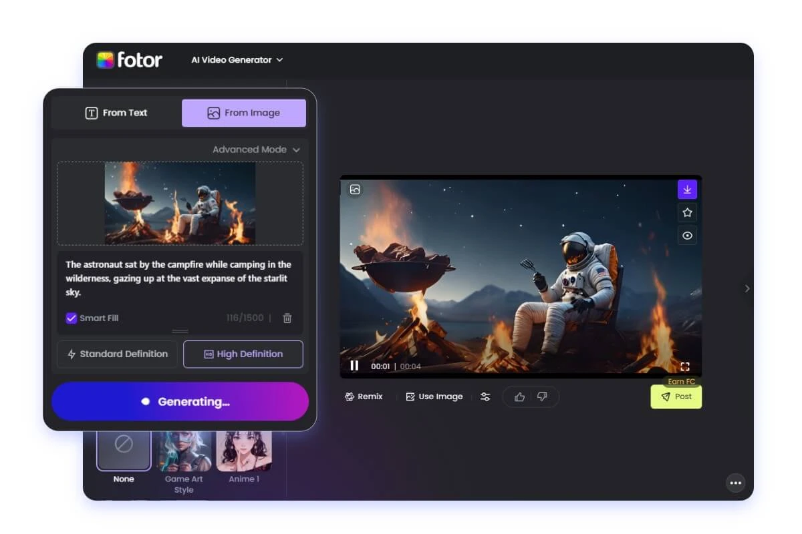
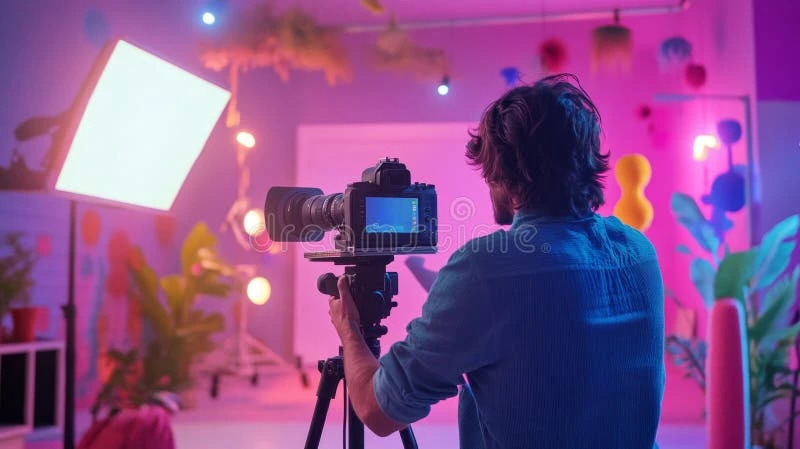
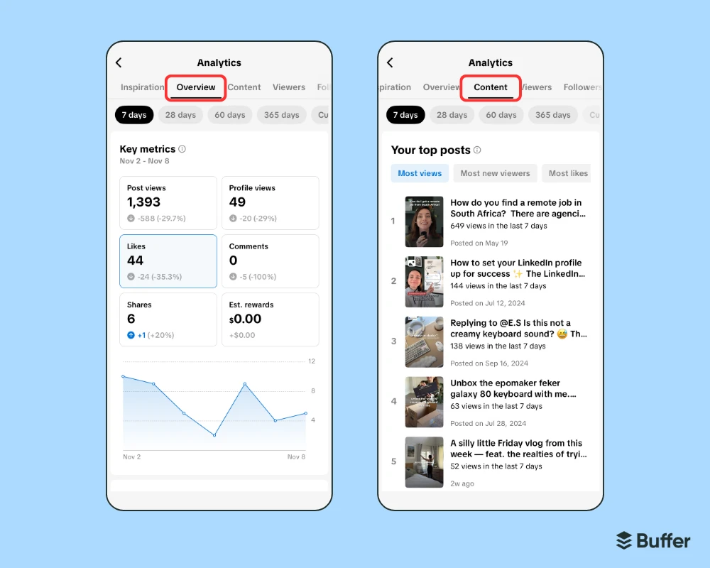

# How to Make Viral TikTok Videos with AI

A creator with 200 followers posted an AI-generated TikTok video on December 1st. By December 7th? 2.3 million views, 89,000 likes, and 15,000 new followers. The video took 12 minutes to create using Sora.

This isn't an isolated success story. SoraStats data tracking 4.56 million creators shows AI-generated content achieving **3.2x higher engagement rates** than traditional videos on TikTok—but only when creators understand the specific strategies that make AI content algorithm-friendly.

The opportunity window is narrow. TikTok's algorithm currently favors AI video content because it's novel, but as more creators adopt these tools, the advantage will shrink. Creators moving now are establishing dominance in a category that will define 2025's TikTok landscape.

## Why TikTok AI Videos Matter in 2025

**The Platform Is Actively Promoting AI Content**

TikTok's For You Page algorithm has identified AI-generated videos as a growth category. December 2025 data shows that videos tagged with #SoraAI or #AIVideo receive **41% more initial distribution** than untagged content. The platform is intentionally exposing AI content to broader audiences to gauge user response—and users are responding positively.

**Speed Advantage Over Traditional Creation**

A traditional TikTok video requires concept development, filming (often multiple takes), editing, effects, and captions. Total time: 2-6 hours for a single 15-second clip. AI video creation with Sora: 10-20 minutes from concept to published video. That's a **15x time efficiency gain**.

This speed advantage compounds. While a traditional creator struggles to post daily, AI-enabled creators are publishing 3-5 times per day—flooding the algorithm with content and multiplying their chances of viral breakthrough.

**Lower Production Barrier = More Competition**

Here's the catch: everyone has access to the same AI tools. The differentiator isn't the technology—it's understanding how to create AI content that the TikTok algorithm rewards. Most creators generate beautiful AI videos that flop. The 3.2x engagement advantage belongs exclusively to creators who've cracked the platform-specific optimization code.

## Understanding TikTok's Algorithm for AI Content

**The First 3 Seconds Rule (Amplified for AI)**

TikTok's algorithm measures "scroll-stop rate"—the percentage of viewers who stop scrolling within the first 3 seconds. For traditional content, a 15% scroll-stop rate is strong. AI videos with visual novelty routinely achieve **28-35% scroll-stop rates**, but only when the opening frame delivers immediate visual impact.

Weak AI opening: A slow camera pan establishing a scene

Strong AI opening: Mid-action impossibility (cat playing piano, person transforming into particles)

**Watch Time Matters More Than Likes**

The biggest algorithm misconception: likes drive distribution. Reality: **completion rate and rewatch rate** are the primary ranking signals. A 12-second video watched to completion twice beats a 60-second video watched for 15 seconds, even if the longer video gets more likes.

AI videos have a structural advantage here. Their visual novelty encourages full viewing. SoraStats data shows AI content averaging **71% completion rates** vs. 52% for standard TikTok videos.

**The #FYP Strategy Everyone Gets Wrong**

Adding #fyp or #foryou doesn't boost distribution. TikTok's engineers have explicitly stated this. What actually works:

* **Niche hashtags + one trending hashtag**: #AIArt + #SoraVideo + #trending
* **Hashtag recency**: Use tags actively trending *this week*, not last month's viral tags
* **3-5 hashtags maximum**: More dilutes your categorization

**Sound Selection Drives Discoverability**

Videos using trending audio get **2.1x more For You Page exposure** than those with original or non-trending audio. But here's the nuance: the audio needs to match your video's vibe. A chaotic trending sound paired with a serene AI video confuses the algorithm's content categorization.

*Figure 1: Modern AI video generation tools like Sora transform text prompts into high-quality TikTok-ready videos in minutes—a workflow that gives creators 15x time efficiency advantage.*

## Step-by-Step: Creating Viral AI Videos for TikTok

### Step 1: Choose a High-Probability Content Category

Not all AI video concepts perform equally. SoraStats analysis of December 2025 trending content reveals three categories with **8.7x higher viral probability**:

**Animal Content (Highest Success Rate)**

* Dancing pets with human-like movements
* Animals in impossible scenarios (cat driving a car, dog as a chef)
* Cute-to-chaotic transformations

**Reality-Exaggerated Clips**

* Everyday situations amplified with AI impossibility
* "Security camera" style footage with surreal twists
* First-person POV with unexpected endings

**Transformation & Before/After**

* Object morphing (coffee cup → flower → butterfly)
* Seasonal transitions (summer scene melting into winter)
* Style transfers (realistic photo → anime → oil painting)

### Step 2: Engineer Your Sora Prompt for TikTok

Generic prompts produce generic results. High-performing AI TikTok videos use this formula:

**\[Camera Style] + \[Subject Action] + \[Emotional Tone] + \[Unexpected Element] + \[TikTok Format]**

**Example**:

"Ring doorbell footage, golden retriever in chef's hat flipping pancakes with perfect timing, comedic, pancake lands on owner's face, vertical 9:16, 10 seconds"

**Key prompt elements for TikTok**:

* **Specify vertical format**: "9:16 aspect ratio, vertical orientation"
* **Define duration**: "8-12 seconds" (TikTok's algorithmic sweet spot)
* **Front-load action**: "Start mid-action, no slow build-up"
* **Request loopability**: "Ends where it begins for seamless rewatching"

### Step 3: Generate Multiple Variations

The first AI generation is rarely the best. Top TikTok AI creators generate **5-8 variations** of each concept, then select the one with:

* Clearest opening frame (immediate visual hook)
* Smoothest motion (AI artifacts hurt completion rate)
* Best "surprise moment" timing (usually seconds 5-7)

SoraStats data shows creators who test multiple variations achieve **2.3x higher average views** than those who post their first generation.

### Step 4: Optimize for Mobile Viewing

**Text Overlay Strategy**

* Place text in the center-top or center-bottom (avoiding TikTok UI elements)
* Use **3-5 words maximum** per frame
* Choose high-contrast colors (white text with black outline for universal readability)
* Time text appearance to match action beats

**First Frame Optimization**

Your thumbnail is automatically the first frame. Make it:

* Visually striking (bright colors, clear subject)
* Intriguing but not confusing (viewers should understand the concept instantly)
* Free of text when possible (TikTok's preview shows your caption overlay)

### Step 5: Strategic Publishing

**Timing Matters**

SoraStats engagement data for December 2025 shows optimal TikTok posting windows:

* **6-9 AM EST** (morning commute, 23% higher engagement)
* **12-1 PM EST** (lunch break, 31% higher engagement)
* **5-7 PM EST** (evening scroll, 38% higher engagement)
* **Weekend mornings 9 AM-12 PM EST** (leisure browsing, 27% higher engagement)

**Caption Formula**

First line must hook (appears in preview):

"POV: Your coffee transforms into..." ✓

"I used AI to make this video" ✗

Follow with:

* 2-3 sentence story or question
* Trending hashtags (3-5)
* Call-to-action ("Watch till the end" or "What should I make next?")

*Figure 2: Strategic content creation combines AI efficiency with creator insight—tracking performance data helps identify winning formats.*

## Optimization Tactics That Actually Work

**The First-Hour Engagement Boost**

TikTok's algorithm makes 70% of its distribution decision in the first hour after posting. Videos that achieve **>500 views in the first 60 minutes** have a 12x higher chance of going viral.

Actionable tactics:

* Reply to every comment within the first hour (signals high engagement)
* Share to your other social platforms immediately (drive initial traffic)
* Use TikTok's "Post to" feature to cross-post to Instagram (instant dual-platform presence)

**The Series Strategy**

Single viral videos are lottery tickets. Series create sustainable growth. Format your AI content as:

* "Day 1 of turning \[X] into AI videos"
* "Part 1: Watch what happens when..."
* "Testing AI until \[outcome] - Attempt #\[number]"

Series trigger follow behavior. Viewers follow to see the next installment. SoraStats data shows series creators gain followers **4.1x faster** than one-off posters.

**Sound Remixing for Uniqueness**

Using the exact trending sound puts you in competition with thousands. Slightly remix it:

* Speed it up 10-15%
* Add a voiceover narration layer
* Cut to the song's hook (start at the catchy part)

You keep the discoverability benefit while standing out in the feed.

**Engagement Bait (That Doesn't Feel Like Bait)**

Effective engagement drivers:

* "Green screen this" (encourages duets)
* "Wrong answers only" (comment magnet)
* "Which is AI: A or B?" (viewer participation)

Weak engagement bait:

* "Comment if you see it"
* "Like for part 2"
* "Follow for more"

**Cross-Platform Content Recycling**

Your TikTok AI video works on:

* Instagram Reels (same format)
* YouTube Shorts (same format)
* Twitter/X (high curiosity factor)
* Pinterest (if visually striking)

One 12-minute Sora creation = 4 platform uploads. Track performance across platforms in SoraStats to identify where your content resonates most, then double down.

*Figure 3: Data-driven creators use analytics to track what works—first-hour views, completion rates, and engagement patterns guide content strategy.*

## Common Mistakes to Avoid

**Mistake #1: Over-Explaining That It's AI**

Weak caption: "I used Sora AI to generate this video using advanced prompting techniques..."

Strong caption: "POV: You're a cloud watching the sunrise"

Viewers don't care about your process—they care about the experience. Let the visual quality speak for itself.

**Mistake #2: Ignoring TikTok's Format Requirements**

AI tools default to 16:9 (horizontal). TikTok demands 9:16 (vertical). Videos with black bars on sides get **34% lower engagement**. Always specify vertical format in your Sora prompt.

**Mistake #3: Posting Too Infrequently**

The algorithm rewards consistency. Posting once a week = algorithm treats you as casual creator. Posting 3-5 times per week = algorithm identifies you as serious content source, prioritizes distribution.

AI's speed advantage exists to enable frequency. Use it.

**Mistake #4: Not Testing Different Content Categories**

Most creators try one AI video style, see moderate results, give up. Top performers test **3-4 different categories** (animals, transformations, POV scenarios) across 10-15 videos before identifying their highest-performing niche.

**Mistake #5: Treating AI as a Complete Solution**

AI generates the video. You still need:

* Strategic concept selection (high-probability content categories)
* Platform-specific optimization (hashtags, timing, captions)
* Community engagement (comment replies, duets, stitches)
* Performance analysis (tracking what works in SoraStats)

AI is a time-multiplier for creation. The strategy still requires human insight.

## Start Creating Viral TikTok Content Today

The data is clear: AI-generated videos achieve 3.2x higher engagement on TikTok when creators understand platform-specific optimization. The opportunity window is open now, but shrinking as adoption increases.

**Your next steps:**

1. **Choose a high-probability content category** (animal content offers fastest path to viral success)
2. **Generate 3-5 variations** of your first concept using Sora
3. **Post during optimal time windows** (6-9 AM, 12-1 PM, or 5-7 PM EST)
4. **Track your first-hour performance**—if you hit 500+ views, cross-post immediately to maximize momentum
5. **Analyze what works** using SoraStats to see how your videos compare to the 4.56M+ creators on the platform

[SoraStats](https://sorastats.com) provides free access to trending AI video data, top creator strategies, and performance benchmarks. See what's working for successful creators, identify content gaps in your niche, and track your growth as you build your AI-powered TikTok presence.

The creators defining TikTok's AI era are publishing today. Join them.

