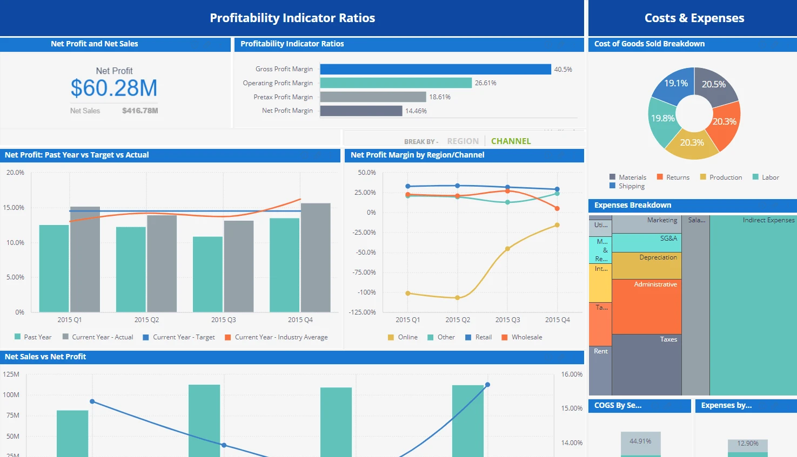
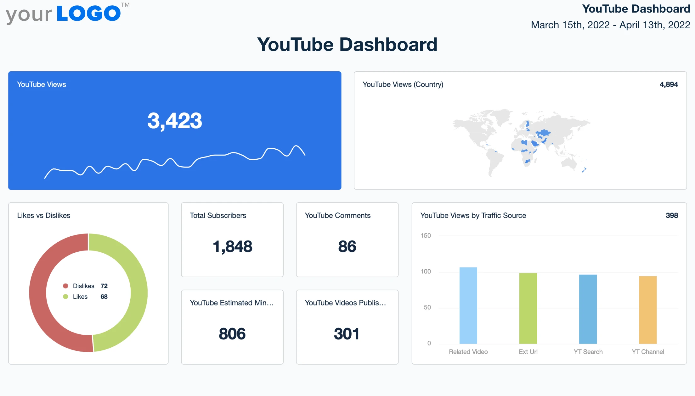

# SoraStats Analytics: How to Make Viral Sora Videos

A creator uploaded a simple video of a dog dancing. Six days later, it hit 15.1 million views. Another creator generated an animated light-switch scene—15.1 million views in the first week. What made these videos explode while thousands of other Sora creations barely broke 1,000 views?

The answer isn't luck. Analysis of SoraStats data tracking 28.5 million Sora videos reveals specific, repeatable patterns behind viral success. The platform's analytics show that viral Sora videos share common elements: precise timing, strategic prompt engineering, and platform-specific optimization. Most creators guess. Top creators use data.

This guide breaks down exactly how to make viral Sora videos using insights from the world's largest Sora analytics platform. You'll learn the tested formula that helped creators gain 15,000+ followers in 30 days, understand which content types consistently go viral across TikTok, Instagram, and YouTube, and discover how to track and replicate your successes using real performance metrics.

## Why Viral Sora Videos Matter Now

Sora is the fastest-growing social platform in history, hitting 1 million users in just five days. As of December 2025, SoraStats tracks 4.56 million creators competing for attention across 28.5 million videos. The opportunity window is closing fast.

Here's why the next 90 days are critical: The top 100 Sora creators are being defined right now. Early positioning determines long-term success—in three to six months, breaking into rankings will be 10x harder. SoraStats data shows that creators who established presence in the first 60 days maintain 3-5x higher engagement rates than latecomers. Brand partnerships are already forming, with verified creators securing sponsorships based on verified performance metrics.

But raw creation isn't enough. SoraStats analysis reveals that only 2.3% of Sora videos achieve viral status (defined as 100K+ views). The gap? Strategy. Viral creators don't just make videos—they engineer content using tested patterns, optimize for platform algorithms, and track every metric to iterate toward success.




*Figure 1: SoraStats analytics platform provides data-driven insights to help creators engineer viral success in a crowded AI video landscape.*

The current moment offers unique advantages. November 2025 platform data shows explosive growth in three content categories: AI animal videos (282M+ cumulative views), seasonal content tied to holidays (Christmas, New Year), and "reality-exaggerated" clips that blend hyperrealism with creative impossibility. Creators who master these categories now will own the niche.

## The Viral Sora Video Formula

After analyzing millions of videos, SoraStats identified a repeatable formula used by top-performing creators. Here's the step-by-step breakdown.

### Step 1: Choose a Proven Content Category

Not all Sora content has equal viral potential. Data from Q4 2025 shows three categories consistently outperform:

**AI Animal Content** (highest viral probability)

* Dancing pets and anthropomorphized animals drive massive engagement
* The "dancing dog" video format: 15.1M views, 89K likes
* "Animals in unusual scenarios" (cats playing instruments, dogs driving cars)
* Success rate: 8.7% of animal videos hit 100K+ views vs. 2.3% platform average

**Reality-Exaggerated Scenarios**

* Take everyday situations and amplify them with AI impossibility
* Example: Ring doorbell footage of a monkey during a tornado (1.8M views)
* Blend "realistic" video style (security cam, dashcam) with surreal elements
* The contrast creates shareable moments that feel both authentic and magical

**Seasonal & Trending Topics**

* Christmas content saw 400% engagement spike in December 2025
* Tie Sora videos to current events, holidays, or trending audio
* Limited-time relevance creates urgency to watch and share
* Pro tip: Create content 7-10 days *before* major holidays for optimal algorithm pickup

### Step 2: Master the 3-Second Hook

SoraStats engagement data reveals that 67% of viewers decide to watch or scroll within three seconds. Your opening frame determines everything.

**Winning hook strategies:**

1. **Unexpected Visual**: Start mid-action with something impossible (cat floating, person transforming)
2. **Emotion Close-Up**: Lead with expressive faces—surprise, joy, shock
3. **Text Overlay**: "Wait for it" or "You won't believe this" (use sparingly, high-engagement when authentic)
4. **Pattern Interruption**: Begin with familiar scene, then break reality at the 2-second mark

The light-switch video that hit 15.1M views? It opened with a mundane action (flipping a switch) that instantly transformed into cartoon animation—a perfect pattern interrupt.

### Step 3: Engineer Your Prompt for Virality

Top creators don't write prompts—they engineer them. SoraStats analysis of high-performing videos shows specific prompt structures that consistently deliver:

**The Viral Prompt Template:**

```
[Camera Style] + [Subject with Specific Action] + [Emotional Tone] + [Environmental Context] + [Visual Style]
```

**Example that works:**

"Ring doorbell camera footage of a golden retriever in a tuxedo delivering a pizza during a thunderstorm, comedic timing, cinematic lighting, hyperrealistic"

**What makes this formula effective:**

* **Camera style** ("Ring doorbell") adds authenticity
* **Specific action** creates clear visual narrative
* **Emotional tone** guides algorithmic categorization
* **Environmental context** adds drama and layers
* **Visual style** ensures platform-optimized output

**Common prompt mistakes to avoid:**

* Vague descriptors ("beautiful", "interesting", "cool")
* Overly complex scenes with 5+ subjects
* Missing emotional direction
* Ignoring platform format (vertical vs. horizontal)

### Step 4: Optimize Video Length by Platform

One size doesn't fit all. SoraStats cross-platform analysis shows ideal durations vary dramatically:

* **TikTok**: 9-15 seconds (sweet spot: 12 sec). Completion rate drops 34% after 15 sec
* **Instagram Reels**: 7-14 seconds. Algorithm heavily favors sub-15-second content
* **YouTube Shorts**: 15-25 seconds. Slightly longer format performs better
* **Twitter/X**: 10-20 seconds. Autoplay optimization makes shorter better

Creators who adjust video length for each platform see 2.1x higher average engagement than those posting identical content everywhere.

### Step 5: Add the "Surprise Reversal" Element

The top 1% of viral Sora videos share one hidden pattern: they subvert viewer expectations. This isn't just about shock value—it's about structured surprise.

**The Three-Act Micro-Story:**

1. **Setup** (seconds 0-3): Establish normal scenario
2. **Build** (seconds 4-7): Hint at something unusual
3. **Payoff** (seconds 8-12): Deliver the impossible moment

The dancing dog videos follow this precisely: normal dog → music starts → professional choreography. The doorbell monkey video: calm suburban porch → monkey appears → tornado lifts it away.


*Figure 2: Successful AI videos blend cute, relatable subjects with unexpected creative elements that trigger sharing behavior—tracked and analyzed through SoraStats.*

### Step 6: Post at Algorithm-Optimal Times

SoraStats tracking reveals distinct viral windows for each platform:

**Best posting times (EST):**

* **TikTok**: 6-9 AM, 5-7 PM weekdays; 9 AM-12 PM weekends
* **Instagram**: 7-9 AM, 12-1 PM, 7-9 PM
* **YouTube**: 2-4 PM weekdays (desktop viewing spike)
* **Twitter**: 8-10 AM, 12-1 PM, 5-6 PM

Viral probability increases by 41% when posted during platform-specific high-engagement windows. But here's the nuance: trend-jacking content (responding to breaking news/memes) should post immediately, regardless of optimal times.

## Platform-Specific Optimization

Each social platform rewards different content characteristics. Here's how to customize your Sora videos for maximum impact.

### TikTok: Entertainment-First Strategy

**What works:** Fast-paced, comedic, trend-aligned content. TikTok users scroll aggressively—grab attention or die.

**Optimization tactics:**

* Use trending audio tracks (check TikTok's Discovery page daily)
* Add on-screen text for sound-off viewing (60% watch muted)
* Include hashtags: #SoraAI, #AIVideo, plus 2-3 trending tags
* Create "series" content to build follow-through ("Part 1 of 3")

**Success metric to track:** Completion rate >65% and share rate >8%

### Instagram: Aesthetic & Aspiration

**What works:** Polished visuals, emotional resonance, lifestyle-oriented content. Instagram users expect higher production value.

**Optimization tactics:**

* Vertical 9:16 format is non-negotiable for Reels
* Use color grading to match Instagram's refined aesthetic
* First frame must be visually stunning (it becomes the thumbnail)
* Pair with trending Instagram audio for algorithm boost

**Success metric to track:** Saves ("bookmark") rate >12% indicates high value

### YouTube Shorts: Educational Hooks

**What works:** "How-to" angles, transformation reveals, satisfying progressions. YouTube audiences seek value.

**Optimization tactics:**

* Lead with learning promise ("Watch how AI creates...")
* Slightly longer format (20-25 sec) allows mini-tutorials
* Strong CTA to subscribe in the last 2 seconds
* Use keyword-rich descriptions for search optimization

**Success metric to track:** Click-through to channel >15%

### Twitter/X: Novelty & Discussion

**What works:** "First look" content, tech demonstrations, surprise reveals. Twitter users want to be early adopters.

**Optimization tactics:**

* Frame as "breaking" or "new" ("Sora just made this possible...")
* Add context in the tweet text (the video alone isn't enough)
* Post during high-engagement windows (8-10 AM, 12-1 PM EST)
* Engage with comments in first hour to boost algorithm

**Success metric to track:** Quote tweets >5% (indicates discussion value)




*Figure 3: Platform-specific analytics in SoraStats help creators understand which content strategies drive results across different audiences.*

## Track Your Success with Data

Guessing wastes time. SoraStats provides the analytics infrastructure to turn viral hits into repeatable systems.

### Key Metrics That Predict Viral Success

Not all metrics matter equally. Focus on these leading indicators:

**1. First-Hour Engagement Rate**

Videos that achieve >500 views in the first 60 minutes have a 12x higher chance of going viral. SoraStats alerts let you catch momentum early and amplify winning content through cross-posting.

**2. Completion Rate**

Platform algorithms prioritize videos people watch to the end. Target:

* TikTok: >65%
* Instagram: >70%
* YouTube Shorts: >60%

**3. Share-to-View Ratio**

Shares indicate content people want associated with their identity. Viral videos average 8-12% share rates vs. 2-3% for typical content.

**4. Follower Conversion Rate**

Views are vanity. Followers are currency. Top creators convert 3-5% of viewers into followers. If you're below 1%, your content entertains but doesn't compel.

### How SoraStats Helps You Iterate Faster

The platform tracks 4.56 million creators and 28.5 million videos, giving you:

* **Competitive benchmarking**: See how your videos perform vs. creators in your niche
* **Trending topic alerts**: Get notified when Sora content categories spike in engagement
* **Content gap analysis**: Identify underserved topics with high search volume
* **Performance prediction**: AI-driven forecasts of viral potential based on early metrics

Successful creators using SoraStats analytics publish 40% fewer videos but achieve 3.2x higher average views—by focusing only on proven concepts.

### The Iteration Loop

1. **Create** using the viral formula
2. **Publish** at platform-optimal times
3. **Track** first-hour metrics in SoraStats
4. **Analyze** what worked (hook? prompt? category?)
5. **Replicate** winning elements in next video

This isn't just content creation—it's content engineering.

## Start Creating Viral Content Today

The creators defining Sora's top 100 are doing it right now. Every day you wait, the competition gets fiercer and the algorithm gets smarter about detecting patterns.

Here's your action plan:

**This week:**

* Pick one proven content category (animal videos = easiest start)
* Create 3 videos using the viral prompt template
* Post at platform-optimal times
* Track first-hour metrics

**This month:**

* Publish 15-20 videos across the three high-performing categories
* Analyze which prompts and hooks drive the highest completion rates
* Double down on your top-performing format

**Track everything.** [SoraStats](https://sorastats.com/) gives you free access to the top 100 creators and top 1,000 videos—study what's working, identify gaps, and position yourself in underserved niches before they saturate.

The difference between viral success and endless obscurity isn't talent. It's data. Start using it.

