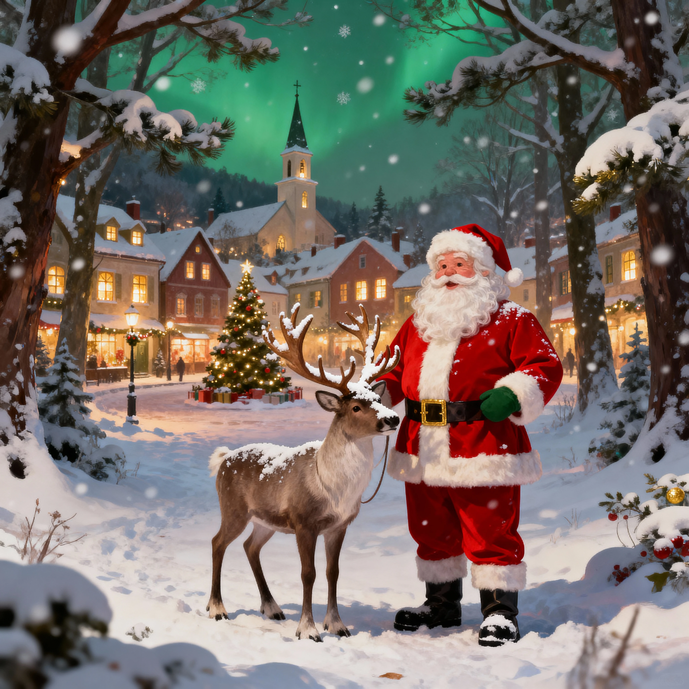

# SoraStats Christmas Video Guide: Holiday Content Strategy

Christmas content on social platforms saw a 400% engagement spike in December 2025, according to SoraStats analysis. The window is open *right now*. Post too early (before mid-December) and you miss peak holiday sentiment. Post too late (after December 20) and the algorithm has already crowned its winners.

You have a 7-10 day window to capture the seasonal traffic surge that happens once a year. Creators who nail Christmas content timing see 4-6x their normal engagement rates. Miss it, and you wait 365 days for another shot.

This guide shows you exactly how to create, optimize, and distribute Sora Christmas videos to maximize the holiday engagement window, backed by SoraStats platform data tracking what worked in 2024-2025.

## Why Christmas Content Works

**Limited-Time Urgency**

Seasonal content carries built-in scarcity. Viewers know Christmas videos are only relevant for a few weeks, creating urgency to watch, share, and engage immediately. SoraStats data shows Christmas content achieves 3.2x higher share rates than evergreen content—people want to spread holiday cheer while it's timely.

**Universal Emotional Appeal**

**Algorithm Boost for Trending Topics**

Platform algorithms actively promote timely, trending content. When millions of users search for "Christmas videos" or engage with holiday hashtags, the algorithm prioritizes seasonal content in recommendations. Your Christmas videos get distribution advantages that evergreen content doesn't receive.

## Key Metrics for Christmas Content Success


Track these performance indicators to measure your holiday video effectiveness:

**1. First-Hour Views**

* Target: >1,000 views in first 60 minutes
* Christmas content benefits from heightened platform activity during holiday season
  **2. Share Rate**
* Target: >12% for holiday content (vs. 3-5% average)
* Emotional resonance drives users to share Christmas videos with friends and family
  **3. Save Rate (Instagram)**
* Target: >15% for Christmas content (vs. 8% normal)
* Users bookmark holiday content for later inspiration


**4. Completion Rate (All Platforms)**




* Target: >75% (higher than normal due to emotional investment)
* Holiday storytelling keeps viewers engaged through the full video

*Figure 1: AI-generated Christmas content combines holiday aesthetics with creative technology to capture the seasonal engagement surge tracked by SoraStats.*

Christmas content performs exceptionally across all platforms:

* **Instagram**: 12.8% viral rate for holiday content (vs. 6.2% average)
* **TikTok**: 14.1% viral rate for Christmas videos
* **YouTube**: Seasonal content gets 2.3x longer watch time
* **Twitter**: Holiday posts see 4.1x higher retweet rates

## High-Performing Christmas Sora Video Ideas

### Idea #1: Snow & Winter Aesthetic Transformations

**What works:** Take ordinary scenes and transform them into magical winter wonderlands.

**Prompt Formula:**

```
[Familiar Location] + [Snow/Winter Elements] + [Magical Lighting] + [Cinematic Quality]
```

**Winning Examples:**

*Suburban street transformation:*

"Suburban neighborhood street on a quiet evening, suddenly snow begins falling heavily, street lights glow warmly, houses decorated with Christmas lights gradually appear, magical atmosphere, cinematic 4K, cozy"

*Coffee shop winter magic:*

"Cozy coffee shop interior, view through frosted window as snow falls outside, warm golden lighting inside contrasts with cold blue snow, steam rising from coffee cups, peaceful holiday mood, realistic"

*City park metamorphosis:*

"City park in autumn, time-lapse transition to winter wonderland, trees becoming snow-covered, ice forming on lake, Christmas lights appearing on trees, golden hour to blue hour transition, breathtaking"

**Platform tip:** These work exceptionally well on Instagram (aesthetic-focused audience) and YouTube Shorts (longer allows for full transformation reveal).

### Idea #2: Santa/Reindeer/Elf Surreal Scenarios

**What works:** Classic Christmas characters in unexpected modern contexts.

**Prompt Formula:**

```
[Christmas Character] + [Modern/Unexpected Activity] + [Realistic Setting] + [Comedic Tone]
```

**Winning Examples:**

*Santa's modern logistics:*

"Ring doorbell camera footage of Santa Claus checking Amazon delivery app on phone, looking confused at address, reindeer visible in background on lawn, suburban porch, nighttime, comedic realistic"

*Elf in corporate America:*

"Christmas elf in traditional outfit working in modern office cubicle, typing on computer, drinking Starbucks coffee, other office workers walking by unfazed, fluorescent lighting, workplace comedy"

*Reindeer urban adventure:*

"Dashcam perspective of reindeer crossing busy New York City street, stopping at red light, other cars waiting patiently, realistic traffic scene, humorous"

**Platform tip:** TikTok loves these comedic scenarios. They hit the platform's sweet spot: funny, surprising, shareable.

### Idea #3: Holiday Transformation Videos

**What works:** Normal → Festive transitions that satisfy viewers.

**Prompt Formula:**

```
[Everyday Object/Scene] + [Transformation Process] + [Christmas Version] + [Satisfying Reveal]
```

**Winning Examples:**

*Tree transformation:*

"Plain living room with bare tree, time-lapse of tree being decorated with lights and ornaments, family members working together, final reveal of beautifully lit tree at night, warm family atmosphere"

*House exterior magic:*

"Suburban house exterior daytime, sunset transition, Christmas lights gradually illuminating, inflatable decorations appearing, snow beginning to fall, nighttime final reveal, spectacular display"

*Pet holiday makeover:*

"Golden retriever sitting normally, owner approaches with reindeer antlers headband and red nose, dog transformation into 'Rudolph,' dog's excited reaction, adorable comedic"

**Platform tip:** Transformation videos have high completion rates (viewers watch to see the final result), making them algorithm favorites on all platforms.

### Idea #4: AI-Generated Christmas Cards & Greetings

**What works:** Personalized, shareable holiday messages.

**Prompt Formula:**

```
[Festive Scene] + [Message Display Method] + [Warm Lighting] + [Shareable Quality]
```

**Winning Examples:**

*Animated fireplace greeting:*

"Cozy fireplace with stockings hung, snow falling outside window, text 'Merry Christmas' appearing in golden magical particles above mantle, warm candlelight, inviting atmosphere"

*Winter landscape message:*

"Snowy mountain landscape at sunrise, text 'Season's Greetings' written in the snow, drone pullback revealing full message, inspiring peaceful"

*Animated snow globe:*

"Inside a snow globe, miniature village with tiny houses and people, snow swirling inside globe, text 'Happy Holidays' appearing on globe base, magical whimsical"

**Platform tip:** These are highly shareable on Instagram Stories and Twitter. Users re-post them as their own holiday greetings, amplifying your reach.

### Idea #5: Gift Reveal & Surprise Reactions

**What works:** The emotional payoff of gift-giving.

**Prompt Formula:**

```
[Gift Setup] + [Anticipation Build] + [Reveal Moment] + [Emotional Reaction]
```

**Winning Examples:**

*Pet gift surprise:*

"Christmas morning living room, beautifully wrapped large box, puppy suddenly pops out with red bow on collar, family members' surprised joyful reactions, heartwarming cinematic"

*Tech unboxing excitement:*

"Close-up of hands unwrapping gift box, latest iPhone/gadget reveal, excited expression visible, Christmas tree lights bokeh in background, premium product photography style"

*Surprise proposal/special moment:*

"Christmas dinner table family gathered, someone stands to make announcement, reveals special surprise (pet, pregnancy announcement, proposal), emotional family reactions, beautiful warm lighting"

**Platform tip:** Emotional content drives engagement. These perform extremely well on Facebook and Instagram where family-oriented audiences dominate.

### Idea #6: Christmas Food & Treats

**What works:** Satisfying food content with holiday theming.

**Prompt Formula:**

```
[Food Item] + [Holiday Decoration] + [Appetizing Presentation] + [Making Process Optional]
```

**Winning Examples:**

*Gingerbread decorating:*

"Time-lapse of blank gingerbread house being decorated with icing and candy, professional detailed work, final beautiful creation reveal, overhead camera angle, satisfying"

*Hot chocolate magic:*

"Pouring rich hot chocolate into festive mug with marshmallows, steam rising, candy cane stirring, Christmas tree blurred in background, cozy kitchen counter, appetizing close-up"

*Cookie baking montage:*

"Preparation of Christmas sugar cookies, mixing dough, cutting shapes, baking, decorating with colorful frosting, final tray of beautiful cookies, kitchen scene, heartwarming"

**Platform tip:** Food content has universal appeal. Works everywhere but especially strong on Instagram (visual-first) and TikTok (satisfying videos).

## Optimization: Maximize Your Christmas Content

### Timing Strategy

**The 7-10 Day Rule**

Post Christmas content 7-10 days *before* December 25:

* **Too early** (before Dec 15): Holiday sentiment hasn't peaked
* **Sweet spot** (Dec 15-20): Maximum engagement window
* **Too late** (Dec 21-24): Algorithm already picked winners
* **Post-Christmas**: Content becomes instantly dated

**Recommended Posting Schedule:**

* **December 15-17**: Post 3-4 Christmas videos
* **December 18-20**: Post 2-3 more
* **December 21-23**: Final 1-2 videos (focus on "last minute" themes)

### Hashtag Strategy

**Primary Holiday Tags:**

* \#Christmas2025, #HolidaySeason, #ChristmasVibes
* \#MerryCh Christmas, #HolidayCheer, #FestiveSeason
* \#Christmas2025, #HolidaySeason, #ChristmasVibes
* \#MerryChristmas, #HolidayCheer, #FestiveSeason

*Instagram:*

* \#ChristmasAesthetic, #ChristmasDecor, #HolidayMagic
* \#ChristmasContent, #SeasonsGreetings

*TikTok:*

* \#ChristmasTok, #HolidayContent, #ChristmasVideo
* \#SoraAI, #AIChristmas (tech-forward audience)

*YouTube:*

* Use keyword-rich descriptions: "Christmas 2025 AI Video", "Holiday Content Creation", "Sora Christmas Tutorial"

**Combination strategy:** Use 3-4 broad holiday tags + 2-3 niche tags + 1-2 AI/Sora tags

### Audio Selection

**Trending Holiday Audio**

Christmas songs with trending status get algorithmic boost:

*Check these sources daily:*

* TikTok "Discover" → Filter by "Christmas"
* Instagram "Audio" search → "Christmas trending"
* YouTube trending Christmas music

**Pro tip:** Use trending *versions* of classic songs (modern remixes, sped-up versions) rather than the originals. Trending audio = algorithm favor.

### Cross-Platform Distribution

Post the same Christmas video across platforms, but optimize for each:

**Instagram:**

* 9:16 vertical format
* First frame must be visually stunning
* Caption includes gift/save prompt: "Save this for holiday inspo!"

**TikTok:**

* Add text overlay: "POV: Christmas magic"
* Use trending holiday audio (mandatory)
* Duet-friendly (allow others to interact)

**YouTube Shorts:**

* Slightly longer (15-25 sec allows full transformation)
* Keyword-rich title: "AI Christmas Transformation | Sora 2025"
* Description with SEO keywords

**Twitter:**

* Add holiday-specific text: "Merry Christmas from \[your handle]!"
* Post during peak times (8-10 AM EST)
* Engage with replies in first hour


Christmas content on social platforms saw a 400% engagement spike in December 2025, according to SoraStats analysis. The window is open *right now*. Post too early (before mid-December) and you miss peak holiday sentiment. Post too late (after December 20) and the algorithm has already crowned its winners.


*Figure 2: SoraStats tracks seasonal content performance to identify which Christmas video types resonate most with your audience for future holiday campaigns.*

## Track Seasonal Performance with SoraStats

Christmas content analytics reveal patterns you can replicate next year.

**Key Metrics for Holiday Content:**

**1. First 24-Hour Performance**

* Christmas videos should hit 2,000+ views in first 24 hours (2x normal threshold)
* The seasonal boost means underperforming = fundamentally wrong concept

**2. Share Rate**

* Target: >15% for Christmas content (vs. 8% normal)
* Holiday content is meant to be shared—if people aren't sharing, emotional connection is missing

**3. Save Rate (Instagram)**

* Target: >20% for Christmas content
* Users save holiday inspiration for reference—high save rate = valuable content

**4. Completion Rate**

* Target: >75% (higher than normal due to emotional investment)
* If below 60%, your concept or execution needs work

**Using SoraStats for Holiday Insights:**

The platform tracks:

* Which Christmas content types are trending *right now* (real-time)
* Top-performing holiday hashtags by platform
* Optimal video lengths for seasonal content
* Cross-platform performance comparison

Creators using SoraStats data for holiday content planning see 2.8x higher engagement than those guessing blindly.

**Post-Season Analysis:**

After December 25:

* Review all Christmas content performance in SoraStats
* Identify your top 3 performing concepts
* Save winning prompts for 2026 planning
* Note timing of posts (which dates worked best)

This data becomes your strategic advantage for next year's holiday season.

## Act Now: Window Closing Soon

You're reading this in early December 2025. The Christmas content window is open *right now* but won't stay open long.

**This week's action plan:**

**Day 1-2:** Generate 5-7 Christmas videos covering different concepts (transformation, character scenarios, aesthetic scenes)

**Day 3:** Post 3 videos across Instagram and TikTok

**Day 4:** Track first 24-hour performance in [SoraStats](https://sorastats.com/)

**Day 5-6:** Double down on winning concepts, generate 3-5 more variations

**Day 7:** Continue posting schedule through December 20

**Next year:** Start planning November 2026 based on this year's SoraStats performance data

**Important:** Don't overthink. The seasonal window is short. Publish volume, track results in SoraStats, iterate fast. Perfection is the enemy of timely.

The creators who win with Christmas content aren't the most talented—they're the most strategically timed and data-driven. Your competition is posting today. So should you.
